exclude: true
<style type="text/css">
code.r{
  font-size: 16px;
}
pre {
  font-size: 16px !important;
}
</style>
```{r setup, include=FALSE}
options(htmltools.dir.version = FALSE)
```
---
class: split-two
<link rel="stylesheet" href="https://cdnjs.cloudflare.com/ajax/libs/font-awesome/4.7.0/css/font-awesome.min.css">
.column.bg-main1[
.font2.comfortaa.coral[Predicción de sequía agrícola en Chile:<br> Regresión lineal vs Deep Learning]<br><br>
.font_large.comfortaa[Una aplicación en `r anicon::faa('r-project', animate='bounce', size=1,color='#165CAA')` con datos geoespaciales `r anicon::faa('map-marker-alt', animate='float', size=1,color='#165CAA')`]
</br></br></br></br>
.font2.comfortaa[Francisco Zambrano  Bigiarini <br><br> Investigador en .yellow[Hémera]<br>]
.font1.comfortaa[`r anicon::faa('link', animate='vertical', rtext='&nbsp;hemera.umayor.cl', color='white')` <br>]

.font_large.comfortaa[`r anicon::faa('github', animate='pulse', rtext=' frzambra', color='white')` <br> `r anicon::faa('twitter', animate='pulse', rtext=' @frzambra', color='00acee')`<br>`r anicon::faa('envelope', animate='pulse', rtext=' francisco.zambrano@umayor.cl', color='white')`<br>]
.font_large.comfortaa[LatinR 2019, Santiago, Chile</br>
27 Septiembre, 2019]
</br>
.font_large[`r anicon::faa('link', animate='vertical', rtext='&nbsp;https://bit.ly/2nMINjf', color='white')`
]
]
.column.bg-main3.center[
</br></br>
.vmiddle[]
]
<!-- --- -->
<!-- class: bg-main1 -->

<!-- # Why am I here? -->

<!-- -- -->
<!-- ### Teach you how to code in R `r emo::ji("x")` -->

<!-- -- -->
<!-- ### Teach you how you *should* use R `r emo::ji("heavy_check_mark")` -->

<!-- -- -->
<!-- ### Teach you how to make writing R code enjoyable `r emo::ji("heavy_check_mark")` -->

<!-- -- -->
<!-- ### Teach you how to learn R `r emo::ji("heavy_check_mark")` -->

<!-- --- -->
<!-- class: middle bg-main1 -->

<!-- # How most academics learn R -->

<!--  -->

<!-- --- -->
<!-- class: middle bg-main1 -->

<!-- # How .yellow[should] you use R? -->

---
layout: true
---
class: split-two with-border border-white fade-row2-col1 fade-row3-col1 fade-row4-col1

.column[
  .split-four[
  .row.bg-main1[.content.font2[
¿Cuál es el .yellow[problema] y como afrontarlo?
  ]]
  .row.bg-main4[.content.font2[
Procesamiento de datos `r anicon::faa('map-marker-alt', animate='float', size=1,color='yellow')` con `r anicon::faa('r-project', animate='bounce', size=1,color='#165CAA')`?
]]
  .row.bg-main4[.content.font2[
Modelos de predicción `r anicon::faa('chart-line', animate='float', size=1)`
]]
  .row.bg-main4[.content.font2[
Próximos pasos `r anicon::faa('walking', animate='float', size=1)`]]
]]

.column.bg-main1[.content.center.vmiddle[


]]


<!-- --- -->
<!-- class: hide-row2-col1 hide-row3-col1 hide-row4-col1  -->
<!--  -->
<!--  -->
<!-- --- -->
<!-- class: hide-row3-col1 hide-row4-col1 -->
<!--  -->
<!--  -->
<!--  -->
<!-- --- -->
<!-- class: hide-row4-col1 -->
<!--  -->

<!-- --- -->
<!-- class: -->
<!--  -->

<!-- --- -->
<!-- class: fade-row2-col1 fade-row3-col1 fade-row4-col1  -->
---
layout: false
class: bg-main1

# .yellow[Sequía] agrícola en Chile

.font2.comfortaa[Déficit de .yellow[precipitación] persistente en la zona .yellow[Centro-Sur] de Chile desde el año 2007.]

.center[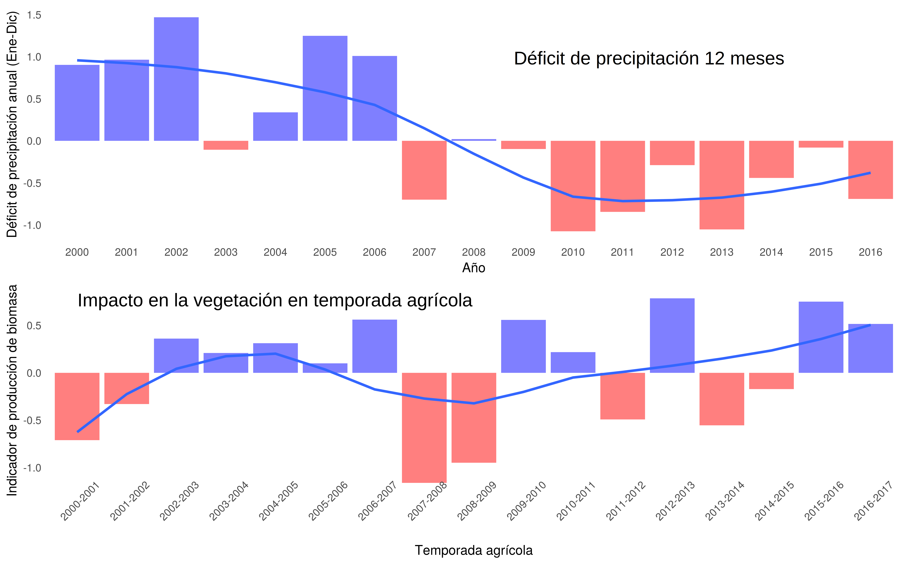]

<!-- --- -->
<!-- layout: false -->
<!-- class: bg-main1 -->
<!-- # .yellow[Sequía] en Chile -->

<!-- ## Año 2019 -->

<!-- .center[] -->

---
layout: false
class: bg-main1
# ¿Cómo podemos evaluar la sequía agrícola a escala regional?

.font2.comfortaa[
- Modelos de simulación de crecimiento de cultivos `r icon::fa('times')`

- Encuestas productivas (rendimientos, producción) `r icon::fa('times')`

- Uso de un .yellow[proxy] de producción agrícola. `r icon::fa('check')`
  - Índices de vegetación obtenidos de imágenes satelitales.

]

---
layout: false
class: bg-main1

# .yellow[Proxy] de producción agrícola 

.font2.comfortaa[.yelloe[NDVI:] índice más utilizado]

.center[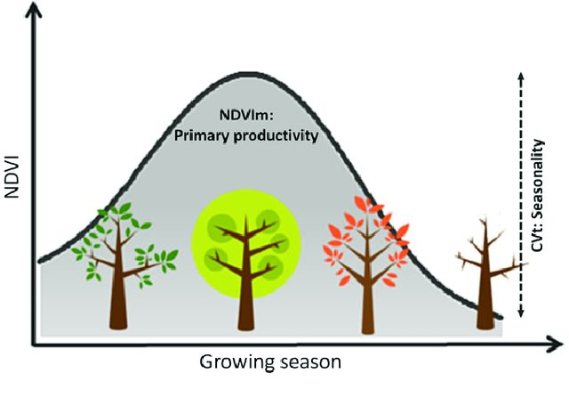]

---
class: bg-main1

# .yellow[Proxy] propuesto

.font2.comfortaa[Considera el acumulado en la temporada]

.center[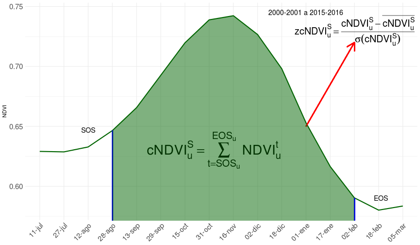]

---
class: bg-main1

# Propuesta de predicción

.font2.comfortaa[
- .yellow[Data:] Series temporaels de datos satelitales entre año 2000 al 2017 
  - Índices de vegetación (MOD13Q1)
  - Landcover y Fenología (MCD12Q1, MCD12Q2)
  - Precipitación (CHIRPS v2)
  
- .yellow[Output:] proxy de producción agrícola $(zcNDVI)$

- .yellow[Inputs:]
  - Proxy de producción meses antes del término de la temporada agrícola.
  - Índices de precipitacion estandarizada (SPI), 1, 3, 6, 12 y 24 meses.
  - Índices de oscilación climática (PDO y MEI)
]
---
layout: false
class: bg-main1

# Propuesta de predicción

.font2.comfortaa[
- .yellow[¿Cuándo?:] 1 a 6 meses antes del término de la temporada agrícola

- .yellow[¿Dónde?:] A nivel de distrito censal entre las regiones de Coquimbo a Los Ríos.
]

---
class: split-two with-border border-white fade-row1-col1 fade-row3-col1 fade-row4-col1

.column[
  .split-four[
  .row.bg-main1[.content.font2[
¿Cuál es el .yellow[problema] y como afrontarlo?
  ]]
  .row.bg-main4[.content.font2[
Procesamiento de datos `r anicon::faa('map-marker-alt', animate='float', size=1,color='yellow')` con `r anicon::faa('r-project', animate='bounce', size=1,color='#165CAA')`?
]]
  .row.bg-main4[.content.font2[
Modelos de predicción `r anicon::faa('chart-line', animate='float', size=1)`
]]
  .row.bg-main4[.content.font2[
Próximos pasos `r anicon::faa('walking', animate='float', size=1)`]]
]]

.column.bg-main1[.content.center.vmiddle[


]]

---
layout: false
class: bg-main1

# ¿Por qué utilizar  `r anicon::faa('r-project', animate='bounce', size=1,color='#165CAA')` para procesar datos geoespaciales?

.blockquote.font_large[
- Por todas las ventajas que tiene para análisis de datos e investigación reproducible.

- Porque existe el paquete .yellow[sp] `(Pebesma and Bivand, 2005)`

- Porque existe el paquete .yellow[raster] `(Hijmans, 2010)`
]

---
layout: false
class: bg-main1

# ¿Por qué utilizar  `r anicon::faa('r-project', animate='bounce', size=1,color='#165CAA')` para procesar datos geoespaciales?

.center[]
---
class: bg-main1

# Principales .yellow[paquetes] usados

.font2.comfortaa[
- .yellow[raster] `(Hijmans, 2010)` `r icon::fa('arrow-right')` Procesamiento de series temporales de imágenes satelitales

- .yellow[maptools] `(Bivand et al., 2003)` `r icon::fa('arrow-right')` Manejo de datos vectoriales

- .yellow[ggplot2] `(Wickham, 2007)` `r icon::fa('arrow-right')` Gráficos y mapas

- .yellow[plyr] `(Wickham, 2008)` `r icon::fa('arrow-right')` Procesamiento de datos agregados a nivel de distrito censal
]

---
class: bg-main1

# Principales .yellow[paquetes] usados

.font2.comfortaa[
Más tarde:

- .yellow[sf] `(Pebesma, 2016)`

- .yellow[dplyr] `(Wickham, 2014)` 

- .yellow[purrr] `(Henry and Wickham, 2015)`
]

---
layout: true
class: split-two with-border border-white

.column[
  .split-four[
  .row.bg-main1[.content.font2[
Se determinaron los distritos censales con superfice cultivada.
  ]]
  .row.bg-main4[.content.font2[
Para c/u se estimó el inicio de la temporada agrícola (SOS)
]]
  .row.bg-main4[.content.font2[
Para c/u se estimó el término de la temporada agrícola (EOS)
]]
  .row.bg-main4[.content.font2[
Para c/distrito se calculó el proxy $(zcNDVI)$]]
]]

.column.bg-main3[.content.center.vmiddle[
{{content}}
]] 

---
class: hide-row2-col1 hide-row3-col1 hide-row4-col1 
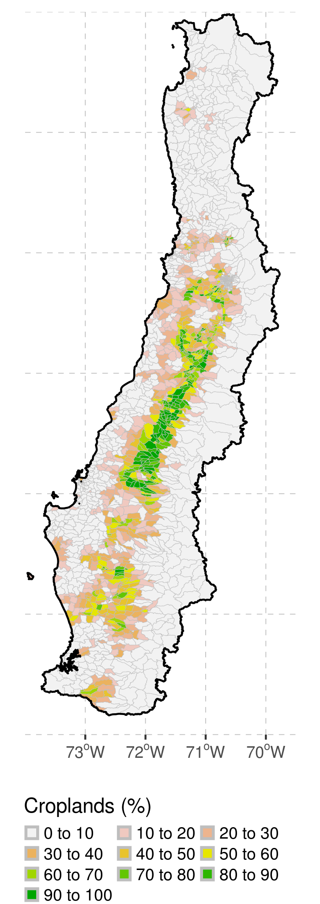
---
class: hide-row3-col1 hide-row4-col1
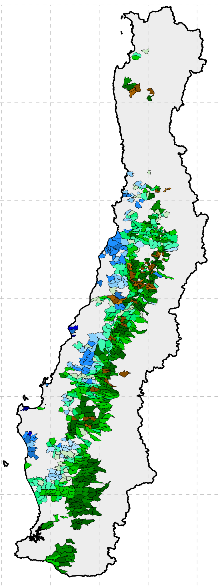
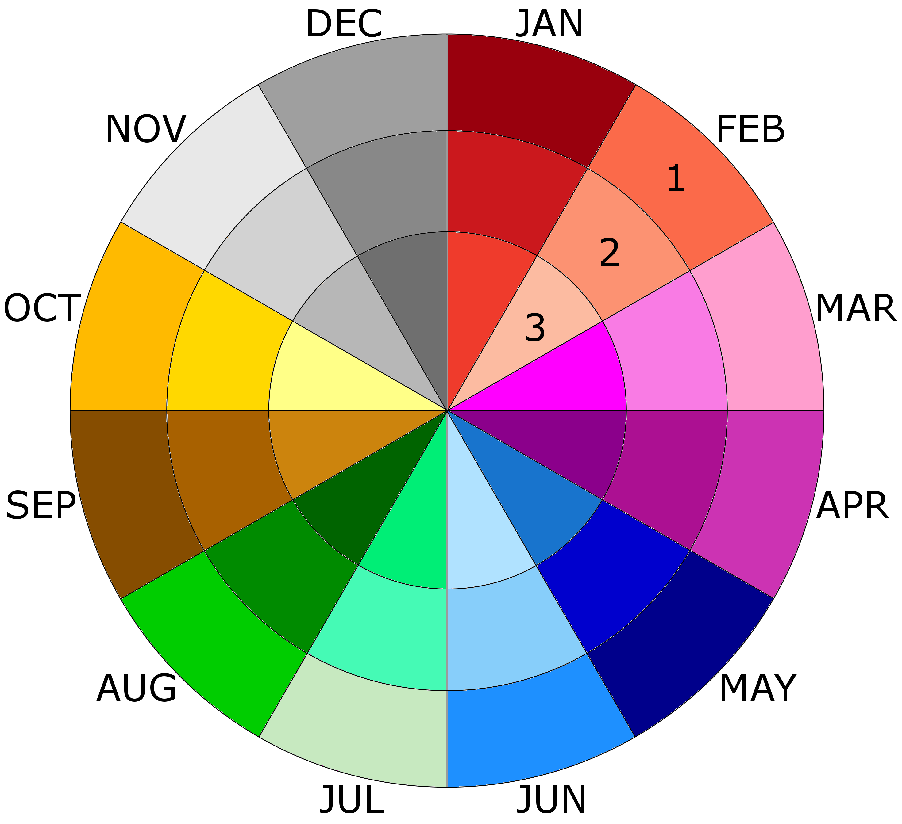
---
class: hide-row4-col1
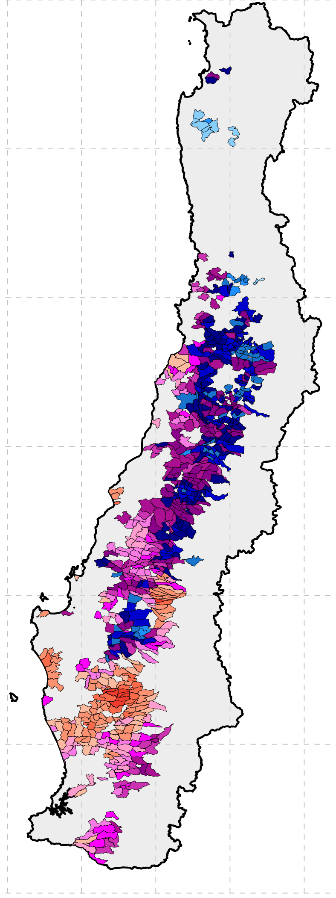


---
class:

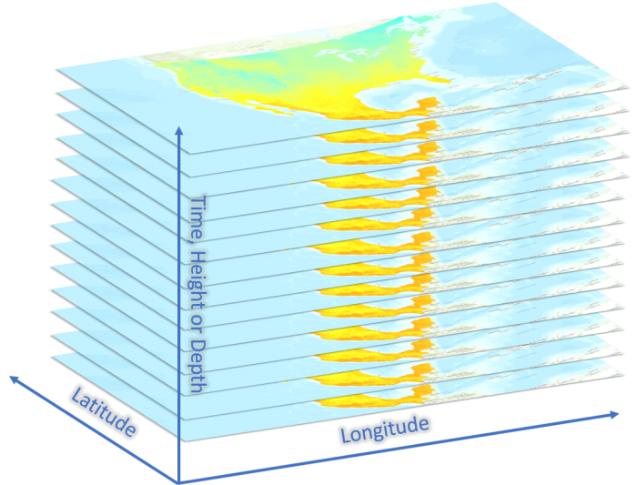
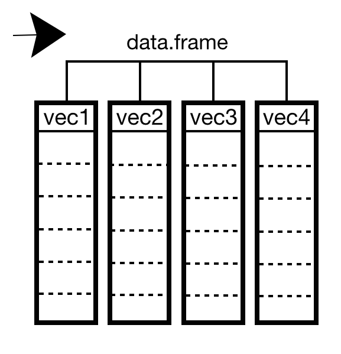

---
layout: false
class: bg-main1

# Validación del .yellow[proxy]

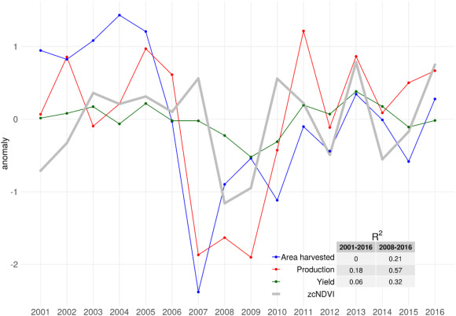
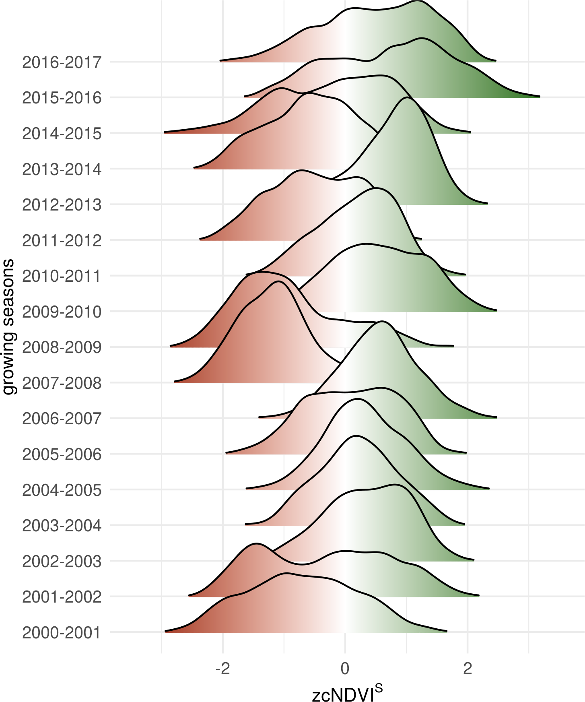

---
class: split-two with-border border-white fade-row1-col1 fade-row2-col1 fade-row4-col1

.column[
  .split-four[
  .row.bg-main1[.content.font2[
¿Cuál es el .yellow[problema] y como afrontarlo?
  ]]
  .row.bg-main4[.content.font2[
Procesamiento de datos `r anicon::faa('map-marker-alt', animate='float', size=1,color='yellow')` con `r anicon::faa('r-project', animate='bounce', size=1,color='#165CAA')`?
]]
  .row.bg-main4[.content.font2[
Modelos de predicción `r anicon::faa('chart-line', animate='float', size=1)`
]]
  .row.bg-main4[.content.font2[
Próximos pasos `r anicon::faa('walking', animate='float', size=1)`]]
]]

.column.bg-main1[.content.center.vmiddle[


]]

---
layout: false
class: bg-main1

# Deep Learning vs Regresión Lineal

.font2.comfortaa[

- Se utilizó un esquema .yellow[LOOCV (leave-one-out cross-validation)]
- Se dejó una temporada fuera y se entreno el modelo con el resto.

.center[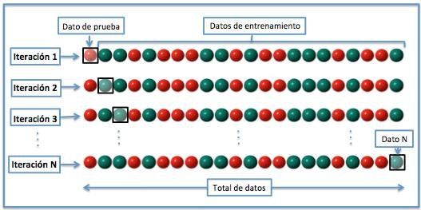]

<!-- $$RMSE_{cv} = \sqrt{\frac{\sum{(zcNDVI^S-\widehat{zcNDVI^S})^2}}{n}}$$ -->

<!-- $$R^2_{cv}$$ -->

]

---
class: bg-main1

.font2.comfortaa[

# Deep Learning vs Regresión Lineal


- Deep Learning: paquete .yellow[H2O] `(LeDell et al., 2014)`
  - Optimización de hyperparámetro .yellow[Random Grid Search]
  - 15 predictores `X` 758 und `X` 17 temporadas `X` 6 tiempos = 1.159.740 datos

- Regresión lineal: función .yellow[lm]
  - 12 predictores `X` 758 und `X` 17 temporadas `X` 6 tiempos = 927.792 regresiones
  - Se Seleccionó el predictor con el menor error $(RMSE_{cv})$

- Evaluación de los modelos: $RMSE_{cv}$ y $R^2_{cv}$
]
---
class: bg-main1

# Resultados

.center[]

---
class: bg-main1

# Resultados

.center[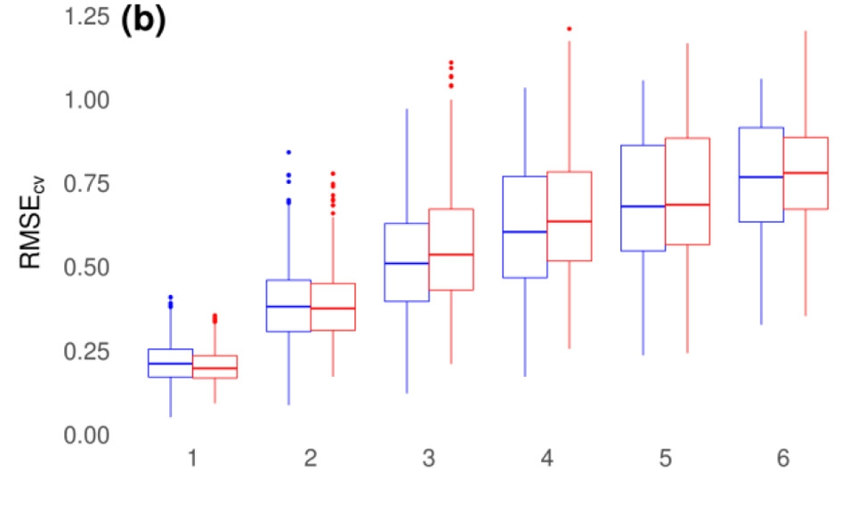]

---
class: bg-main1

# Resultados
## Regresión lineal

.center[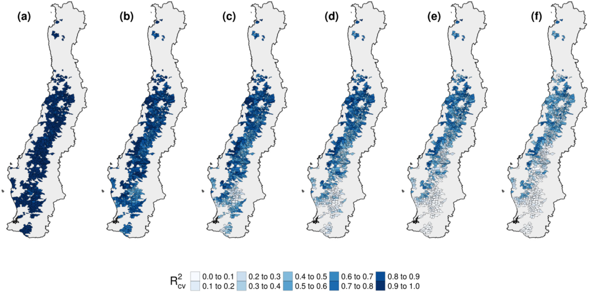]

---
class: bg-main1

# Resultados
## Deep Learning

.center[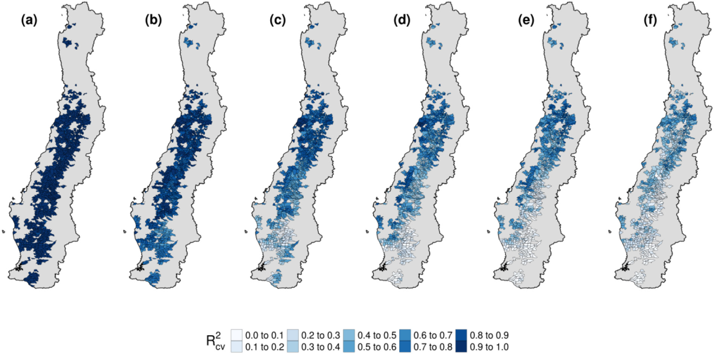]

---
class: split-two with-border border-white fade-row1-col1 fade-row2-col1 fade-row3-col1

.column[
  .split-four[
  .row.bg-main1[.content.font2[
¿Cuál es el .yellow[problema] y como afrontarlo?
  ]]
  .row.bg-main4[.content.font2[
Procesamiento de datos `r anicon::faa('map-marker-alt', animate='float', size=1,color='yellow')` con `r anicon::faa('r-project', animate='bounce', size=1,color='#165CAA')`?
]]
  .row.bg-main4[.content.font2[
Modelos de predicción `r anicon::faa('chart-line', animate='float', size=1)`
]]
  .row.bg-main4[.content.font2[
Próximos pasos `r anicon::faa('walking', animate='float', size=1)`]]
]]

.column.bg-main1[.content.center.vmiddle[

]]
---
layout: false
class: bg-main1

# Algunas Observaciones

.font2.comfortaa[

- Deep Learning (Black Box).

- Una simple regresión lineal (.yellow[en este caso]) iguala a Deep Learning

- Pocos datos para Deep Learning `(LeDell, 2019)`

]

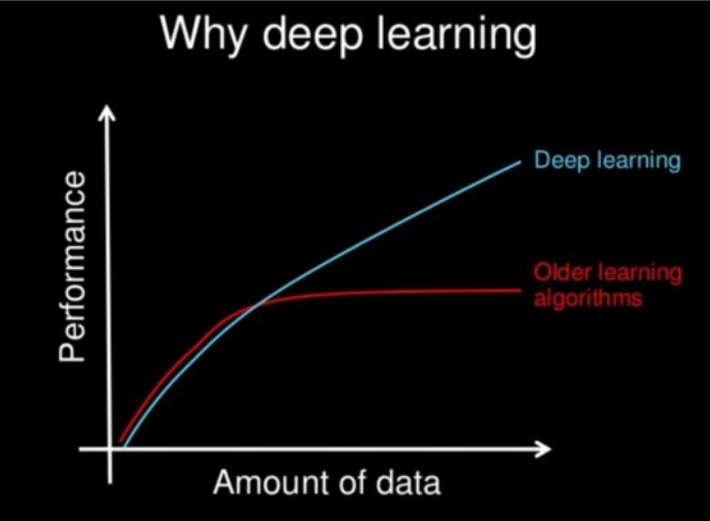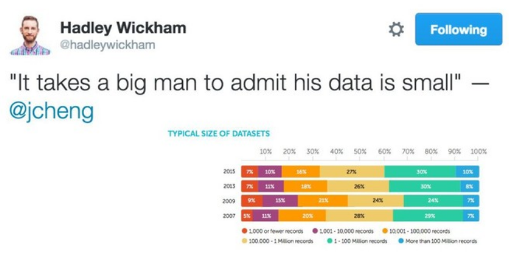

---
class: bg-main1

# Alternativas

.font2.comfortaa[

- Probar .yellow[en este caso] con Gradient Boosting Machine (GBM)

- Realizar el análisis a nivel de .yellow[pixel] con Deep Learning

- Incorporar el paquete .yellow[lime] `(Pederson and Benesty,2017)` para dar interpretabilidad a Deep Learning

- Implementar el procesamiento con los paquetes .yellow[stars] `(Pebesma, 2018)`, .yellow[gdalcubes] `(Appel and Pebesma, 2019)` para mejorar la eficiencia.  

]


---
class: bg-main1 center
#Thanks!


